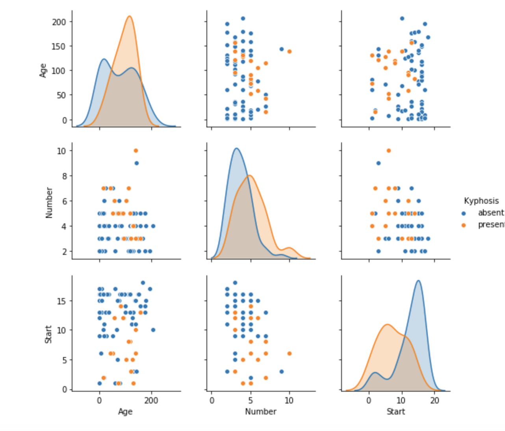
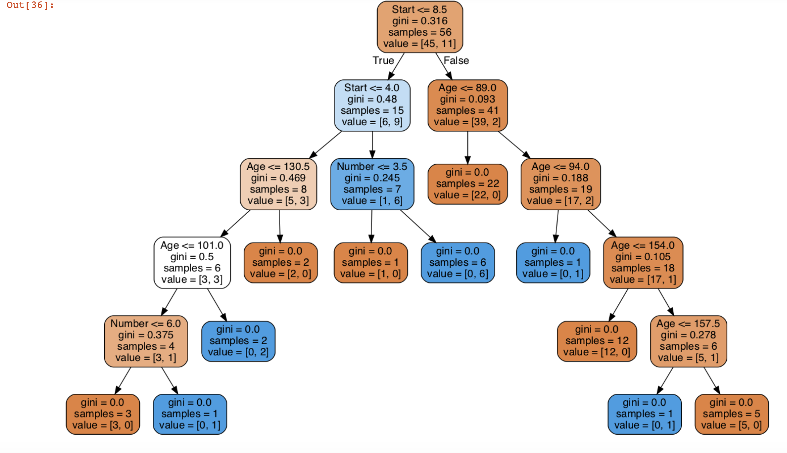

# DecisionTress_and_RandomForests
 This prooject documents machine learning algorithms using Decision Trees and Random Forests. For mathematical concepts regarding Decison Trees and Random Forests, checkout chapter 8 of **[Introduction to Statistical Learning](https://blog.princehonest.com/stat-learning/)** by Gareth James, et al. 

- **A Decision Tree** is an intuitive way of deciding whether an event will occur or not. A Decision Tree have:
 - **Node**: which are split for the value of a certain attribute
 - **Edges**: which are outcome of a split to node
 - **Root**: The node that performs the first split
 - **Leaves**: Terminal nodes that predict the outcome

**Note dwhile training a Decision Trees algorithm, it is important to split the training feature or dataset to get a perfect separation**.

## Random Forests

Random Forests is a way of improveing performance of single Decision Tree. The primary weakness of Decision Trees is that they don't tend to have the best predicting accuracy which is partyly due to the high variance meaning that different split in the training data can lead to very different Decision Trees.

-**Bagging** is a general purpose poceedure for reducing the variance of machine learning method. So we can build of the idea of bagging by utilising **Random Forests**.
- To improve performance, we can use many trees with a random sample of features chosen as the split.
- A new random sample of features is chosen for **every single tree at every single split**
- For **classification**, m is typically chosen to be the square root of p (where 'p' is the full set of features).
- When using **bagged** trees, most of the trees will use that feature the as top split, resulting in an ensemble of similar trees that are **highly correlated**. This is something you want to avoid.

## Significance 
- Averaging highly correlated quantities does not significantly reduce variance.
- By randomly leaving out candidate features from each split, **Random Forests "decorrelates" the tress**, such that the averaging process can reduce the variance of the resulting model.

Checkout this [blog post](https://towardsdatascience.com/enchanted-random-forest-b08d418cb411#.hh7n1co54)

# Project 1: Kyphosis Dataset
- The project contains dataset of Kyphosis (a medical spine condition) patients with the objective of training a model to help predict whether or not a corrective spine surgery was successful. 

## Exploratory Data Anlysis of Kyphosis Dataset

## Decision Trees Visualisation library
You can **Download** the **Graphiz** from [Graphviz.org](https://graphviz.org/download)
- Select the **Executable Package** that you want depending on your operating system.
- Follow the instruction to setup the **PATH**

### Tree Visualisation

# Project 2: Loan Dataset
- This project contains loan dataset from a **Lending Club** to predict default rates.

